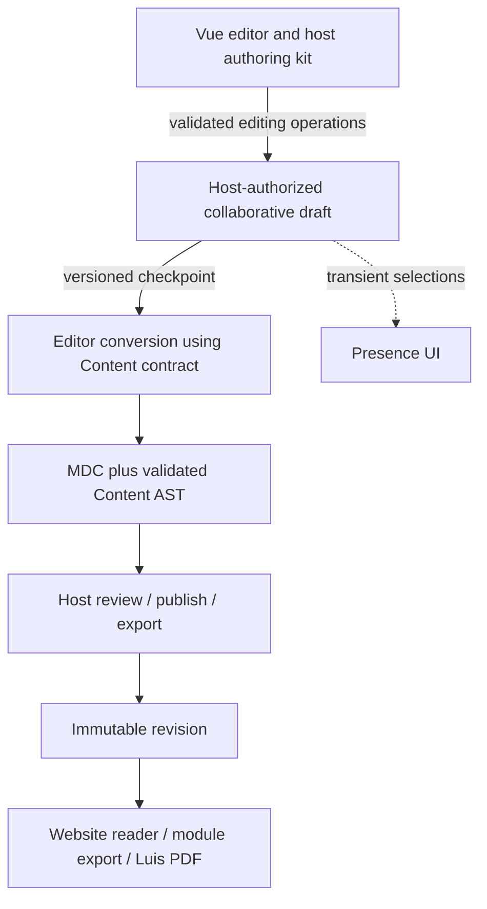

# Ginko Editor experience and multiplayer research

Implementation update, 2026-09-22: the bounded experiment below now has a
working Vue session, a real local Convex proof, and host-owned restart recovery.
It uses ProseMirror's existing merge algorithm with a direct, validated Convex
operation log rather than the React-specific component client. See
[the measured verification record](./collaboration-verification.md) and
[the implementation ledger](./editor-implementation.md). The published Content
`1.0.0-beta.9` passes the Editor suite and packed-consumer checks; the old
beta.7 candidate requirement is removed. The following research records the
starting evidence and alternatives. Its initial preference for Yjs when restart
recovery is required is superseded for the bounded recovery needs now tested.

Research date: 2026-09-22. Status: recommendation for implementation planning, not an accepted migration or a production collaboration certification.

“Kinkou” is interpreted as Ginko; “Lewis” as the supplied `luis2` repository. This report covers the shared editor, Ginko Content, Ginko CMS, ChiliSkills, and Luis. No application behavior, dependencies, accounts, or remote systems were changed.

## Recommendation

Keep Vue 3, TipTap 3, and ProseMirror. Improve the existing editor instead of replacing it with a React editor. Keep Ginko Content as the authority for portable document meaning. Give each host a focused authoring kit and keep its business workflow outside the editor.

For the first shared-editing implementation, evaluate **Convex ProseMirror sync with a Vue client adapter** in one CMS rich-text field. This is the best starting experiment for the existing Convex architecture, provided shared editing can initially require an active online session. It is not a ready-made Vue multiplayer solution.

For a product that must reopen shared documents offline, retain pending edits across browser restarts, and later merge them, prefer **Yjs with Hocuspocus**, while Convex continues to own application records and permissions. That introduces a collaboration service and a persistence integration. Do not independently implement both protocols in production. Decide after the bounded experiment below and before migrating shared drafts.

The important contract change is explicit: a collaborative draft becomes authoritative for active editing. MDC remains the portable checkpoint and publication format. Two independently writable representations of the same draft would create data loss.

## Evidence and actual starting points

Repository state is more reliable than historical rollout notes. The inspected checkouts are:

| Repository | Revision at inspection | Actual starting point |
| --- | --- | --- |
| Ginko Editor | `b834ddf` | Vue package `0.1.0`; TipTap peers pinned to `3.31.3`; Content dependency `1.0.0-beta.7`; Reka UI `2.10.1`. Commands, authoring kits, source recovery, media callbacks, and theme tokens exist. |
| Ginko Content | `0581367` | Portable parsing, serialization, validation, component policy V2, semantic comparison, and asset portability helpers exist. |
| Ginko CMS | `d0e2798` plus unrelated working changes | Studio still imports its embedded editor. Package `0.2.0-rc.2` does not declare the shared Editor dependency. Draft writes use version checks. |
| ChiliSkills | `4d8edbe` | Uses shared Editor/Content/Docs tarballs. Workshop documents live in browser storage; module undo stores whole-document snapshots. No Convex dependency in its package manifest. |
| Luis | `e00f5a2` plus substantial document-feature work in progress | Nuxt, Convex `1.43.0`, and shadcn-vue. Commercial-document editing uses forms and Markdown textareas. No Ginko Editor dependency. |

Relevant implementation:

- [Editor lifecycle and slash menu](/Users/matthias/Git/0_libs/ginko-editor/src/GinkoEditor.vue), [extension configuration](/Users/matthias/Git/0_libs/ginko-editor/src/lib/config/editorConfig.ts), [public API](/Users/matthias/Git/0_libs/ginko-editor/src/index.ts), and [authoring kit](/Users/matthias/Git/0_libs/ginko-editor/src/authoring.ts).
- [Content parser boundary](/Users/matthias/Git/0_libs/ginko-content/packages/content/src/cms-contract/mdc.ts), [component policy](/Users/matthias/Git/0_libs/ginko-content/packages/content/src/types/component-policy.ts), and [portability exports](/Users/matthias/Git/0_libs/ginko-content/packages/content/src/portability/index.ts).
- [CMS field imports the embedded editor](/Users/matthias/Git/0_libs/ginko-cms/packages/cms/studio-app/src/components/studio/fields/FieldRichtext.vue:15), [draft write authority](/Users/matthias/Git/0_libs/ginko-cms/packages/convex/src/entries/workflow/drafts.ts), and [client draft lifecycle](/Users/matthias/Git/0_libs/ginko-cms/packages/cms/studio-app/src/composables/internal/useEntryDraft.ts).
- [ChiliSkills editor host](/Users/matthias/Git/1_apps/chiliskills/app/components/workshop/ScriptEditor.vue), [module persistence and history](/Users/matthias/Git/1_apps/chiliskills/app/composables/useModuleEditor.ts), and [learning-objective kit](/Users/matthias/Git/1_apps/chiliskills/app/lib/scriptAuthoring.ts).
- [Luis document editor](/Users/matthias/Git/1_apps/luis2/app/features/documents/internal/Editor.vue), [domain model](/Users/matthias/Git/1_apps/luis2/shared/documents/model.ts), [Markdown parser](/Users/matthias/Git/1_apps/luis2/shared/documents/markdown.ts), and [revision-checked mutations](/Users/matthias/Git/1_apps/luis2/convex/documents.ts).

The Editor's historical `plan.md` records a shared CMS integration at other revisions. That is not what this CMS checkout runs. Reconcile the relevant branch or candidate before implementation; do not assume the integration is complete or blindly replay old changes.

The referenced application standard and playbook under `lupinum-app` are absent. Repository instructions and source were used instead.

## The editor experience to build

The goal is a calm writing surface with reliable content, discoverable commands, and visible save state. A writer should be able to write a page, add a suitable component, edit it in place, and trust that save/reload/export preserve its meaning.

### Writing surface

Default to one writing pane. Offer reader preview on demand; use split view when there is enough width. Put document title, location, collaborators, and host actions above the editor. Use a compact formatting toolbar and a selection toolbar without duplicating every control at once. Keep publishing, module export, customer selection, and invoice actions with their host.

Show an outline for long documents. Keep it derived from headings. Reserve an inspector or sheet for settings that cannot be edited naturally in the canvas. On narrow screens, show one pane and a touch-friendly insert sheet; avoid shrinking two desktop panes side by side.

Distinguish `Changes on this device`, `Syncing`, `All changes saved`, `Offline`, and `Could not save`. The host must supply the actual persistence status. An Editor `flush()` that emitted MDC is not proof that Convex has saved it.

Keep ordinary Markdown shortcuts, keyboard selection, copy/paste, and a visible Insert button. Preserve the prior explicit decision to remove block dragging and block-order controls. There is no reason to restore six-dot handles merely to resemble Notion.

### Slash commands

Notion provides a useful reference for searchable insertion and familiar writing shortcuts. Use those interaction ideas within Ginko's document contract. [Notion writing basics](https://www.notion.com/help/writing-and-editing-basics), [slash commands](https://www.notion.com/en-gb/help/guides/using-slash-commands).

The current menu already filters recipes and opens near the cursor. Source inspection shows that it focuses a separate search field, offers host recipes before writing commands, uses substring matching, and closes when its saved selection belongs to an older document. That last rule will make remote edits interrupt the menu.

Recommended behavior:

| Situation | Expected behavior |
| --- | --- |
| `/` at the start of an eligible paragraph | Open a small command list anchored to the typed range. Keep typing in the document. |
| `/h2`, `/image`, `/note`, `/lernziel` | Match labels and localized aliases; exact matches before prefix and keyword matches. |
| Slash in a URL, code block, or ordinary sentence | Keep it as text. |
| Arrow keys, Enter, Escape | Move, insert, dismiss. Escape preserves the author's text. One undo reverses insertion. |
| Invalid parent or slot | Hide the command or disable it with a short reason. Validate again when applying it. |
| A remote edit before the slash | Map the trigger range through the edit. Dismiss only if its context was deleted or became invalid. |
| Insert button or touch interaction | Open the same command catalog with the same permissions and validation. |
| IME composition or assistive technology | Do not intercept composition keystrokes. Expose a named listbox, active option, and predictable focus. |

Group commands into Writing, Media, Components, and host-specific entries. Put commonly used writing commands first. Keep recipes deterministic and testable. Do not add usage tracking or a personalized ranking service to solve basic discoverability.

Use a ProseMirror plugin to own the trigger range and menu state. TipTap's Suggestion utility is a candidate; compare its range handling and composition behavior with the existing implementation before replacing it. Its existence does not establish that Ginko's command semantics work. [TipTap Suggestion](https://tiptap.dev/docs/editor/api/utilities/suggestion).

### MDC components

Treat a component as authored content with a schema: a known tag, typed properties, editable slots, valid parents/children, and a reader implementation. A Vue component alone is insufficient evidence that it can be edited safely.

Keep small titles and text in place; put booleans, variants, asset choices, and uncommon options in contextual controls. Preserve selection while opening those controls. Show actual host renderers in preview. Avoid making an interactive quiz or tab switch swallow normal editing clicks in the writing canvas.

The [current coverage document](/Users/matthias/Git/0_libs/ginko-editor/docs/content/docs/1.getting-started/4.component-coverage.md) certifies ten Docs component tags: six callouts, aside, excerpt, layout, and column. It explicitly excludes visual authoring certification for tabs, quizzes, accordions, timelines, and other complex groups.

Expand one family at a time. Recommended order: cards, accordion/steps, then tabs; quizzes only when the ChiliSkills authoring and learner-response models are defined. Each family needs valid insertion, property edits, add/remove child behavior, named-slot behavior, copy/paste, undo, conversion, reader output, and concurrent-edit tests.

For unsupported source, preserve the original and provide a clear source/preview path. Do not silently discard tags, attributes, comments, or slots. A future isolated unsupported-node view is useful only after proving lossless preservation; it is not required for the first rollout.

## What alignment with shadcn means

The current editor is already visually compatible in several respects: Reka primitives, Lucide icons, host theme variables, exported toolbar controls, messages, and customization slots. It is not fully equivalent to shadcn's open-code distribution model. Shadcn emphasizes editable component source and composition as well as appearance. [shadcn-vue introduction](https://shadcn-vue.com/docs/introduction).

Keep the tested parsing, schema, transactions, and lifecycle in the single npm package. Let hosts own or compose the presentation shell. Provide copyable Vue examples for toolbar, insert list, collaboration status, and inspector using public commands. Add a registry only if repeated adoption demonstrates a need; do not create a second package just for distribution.

Complete theme coverage for background, foreground, muted text, border, ring, destructive state, radius, and popover layers. Existing hard-coded component tones should have overrideable semantic tokens. Verify portal placement inside dialogs and sheets, dark mode, RTL, focus restoration, disabled controls, and keyboard shortcuts. Matching colors alone does not establish accessibility.

Avoid exposing unrestricted extension injection as the customization solution. Extensions can change the document schema and silently break source conversion or collaboration. Provide a narrow supported collaboration attachment and schema-compatible presentation slots instead.

BlockNote offers a shadcn adapter, but its documented integration uses React and its block model adds a migration burden. It does not justify replacing the existing Vue implementation. [BlockNote shadcn integration](https://www.blocknotejs.org/docs/getting-started/shadcn).

## Multiplayer options and decision

Real-time database subscriptions deliver updates; they do not merge concurrent rich-text edits. Two clients saving complete MDC strings still compete to replace the same value. Keep existing conflict checks until a genuine collaboration protocol takes ownership.

| Option | Fit | Missing work / cost | Recommendation |
| --- | --- | --- | --- |
| Current version-checked MDC writes | Safely detects stale saves; simplest baseline | Manual resolution; no simultaneous text merge | Keep for documents outside collaboration and scalar workflow fields. |
| Convex ProseMirror sync | Central ordered steps and rebasing; existing Convex database | Vue adaptation, cursor mapping, host authorization and validation, retention/recovery | First bounded online-collaboration experiment. |
| Yjs + custom Convex transport | Can retain one backend service | Own provider protocol, binary updates, catch-up, acknowledgments, compaction, awareness, tests | Feasible custom work; do not choose by assuming Convex is already a Yjs provider. |
| Yjs + Hocuspocus + Convex host | Stronger fit for persistent offline shared drafts and existing Yjs cursor ecosystem | Additional service, durable storage bridge, authentication/revocation, operational recovery | Preferred alternative if offline shared editing is required or the Convex adapter grows too large. |
| Managed TipTap collaboration + Convex host | Removes much service operation | Subscription, document quotas, external draft storage, integration with host publication | Buy when saved maintenance time justifies it. |

OT, or operational transformation, adjusts edits against an ordered shared history. Yjs uses a CRDT, a shared structure designed to merge replicated updates. Neither guarantees that two concurrent business decisions are compatible.

### What was verified about the Convex component

The npm release inspected was `@convex-dev/prosemirror-sync@0.2.6` (2026-07-30, Apache-2.0). Its TipTap peer range includes Ginko's `3.31.3`. The released client module imports React and `convex/react`; even the exported `syncExtension` accepts `ConvexReactClient`. There is no drop-in Vue integration. Offline restart recovery and presence remain outside its supplied feature set. [Released package metadata](https://registry.npmjs.org/@convex-dev/prosemirror-sync/0.2.6), [upstream repository](https://github.com/get-convex/prosemirror-sync).

For the Vue adapter, reuse the host's authenticated Convex client and expose its subscription/mutation operations to the sync lifecycle. Do not cast a Vue client to the React client type or add a second React client and authentication session. Prefer an upstream framework-neutral extraction; otherwise keep a small, explicitly maintained adaptation with attribution. Convex has a framework-independent JavaScript client, but that does not prove this adapter. [Convex JavaScript client](https://docs.convex.dev/client/javascript/overview).

The inspected server accepts serialized steps and snapshots. Its permission callbacks are not Ginko semantic validation. Add host-controlled boundaries that validate document identity, generation, base version, operation limits, schema, and resulting content. A writable client snapshot must not become trusted published content merely because it arrived through Convex. [Inspected server wrapper](https://github.com/get-convex/prosemirror-sync/blob/e257005b1fd666b73cce3d57e5bd2d6f7087ca08/src/client/index.ts), [storage implementation](https://github.com/get-convex/prosemirror-sync/blob/e257005b1fd666b73cce3d57e5bd2d6f7087ca08/src/component/lib.ts).

### Presence, cursors, history, and offline behavior

Presence answers “who is here?” Cursor synchronization answers “where are they editing?” Document persistence answers “which edits are durably saved?” Give each a separate state and lifetime.

Convex Presence `0.4.0` is a candidate for room membership and activity. Cursor decorations still need ProseMirror position mapping. Send a document version with anchor/head positions; map them through later steps and the receiving client's unconfirmed edits. If the required history is unavailable, hide the stale selection and refresh it. Never display an old integer offset as a current cursor. [Convex Presence](https://www.convex.dev/components/presence).

Throttle selection updates, do not send mouse movement, and do not persist cursor metadata as document content. Derive identity from authenticated membership. Keep avatars available before adding full remote selection rendering.

For Yjs, use awareness and relative positions from its ecosystem. Awareness is transient; persistent document updates are separate. Store the Yjs binary state and updates. Reconstructing a fresh Yjs document from MDC or JSON on every connection loses shared identity and can duplicate content. [Yjs awareness](https://docs.yjs.dev/getting-started/adding-awareness), [relative positions](https://docs.yjs.dev/api/relative-positions), [Hocuspocus persistence](https://tiptap.dev/docs/hocuspocus/guides/persistence).

Use one text-undo implementation per editor. With TipTap's Yjs Collaboration extension, disable StarterKit's UndoRedo. With ProseMirror OT, retain a history configuration tested with rebasing; do not apply the Yjs configuration mechanically. Undo should reverse the current user's action without removing another user's later work. Version restoration is a separate host operation. [TipTap Collaboration extension](https://tiptap.dev/docs/editor/extensions/functionality/collaboration).

Hocuspocus `4.7.0` and Yjs `13.6.32` were the npm latest releases on the research date. Hocuspocus provides authentication and storage hooks; integrating these with Convex is custom host work. Enforce expiry and access revocation after connection, not only on initial login. Define when an update is merely synchronized versus durably persisted. [Hocuspocus overview](https://tiptap.dev/docs/hocuspocus/getting-started/overview), [hooks](https://tiptap.dev/docs/hocuspocus/server/hooks).

Run Hocuspocus in a supported long-lived service, not inside a Convex query or mutation. A proposed Convex storage bridge should persist binary updates and checkpoints with generation/version guards; a plain last-write-wins blob upload is insufficient when multiple service instances can write. Verify crash recovery and durable acknowledgment before showing “All changes saved.” Use host-issued document-scoped authorization and a server-controlled persistence endpoint; never expose backend administrative credentials in the editor.

Yjs IndexedDB persistence supplies a basis for reopening documents offline. It still requires a product policy for revoked access, stale schemas, deleted documents, and local asset bytes. Preserve ChiliSkills' current local mode regardless of the shared-editing choice. [Yjs offline support](https://docs.yjs.dev/getting-started/allowing-offline-editing).

## Proposed authority and publication flow



This is a proposal, not the current public API. Keep the existing source-based mode supported. Introduce an explicit collaborative session mode whose type cannot also accept an independently writable source model. Do not hot-swap a mounted editor between authorities.

For a shared field, the host stores a room mapping containing document identity, locale/field identity, generation, editor schema version, Content policy hash, and seed/checkpoint information. These are different concerns: schema versions protect ProseMirror structure; policy hashes protect allowed component meaning; generations reject clients from an obsolete draft.

Recommended checkpoint process:

1. Initialize a room once, from a validated existing source revision, under a server transaction or equivalent single-creator operation. Two clients opening it must not insert the seed twice.
2. Accept bounded, authorized edits against that room. Maintain a trusted checkpoint plus accepted operations, with a defined rebuild path. Do not treat arbitrary client snapshots as truth.
3. On preview/export/publish, await the initiating client's outstanding uploads and edit acknowledgments. Then select a server-confirmed draft version. Other users can continue writing after that version.
4. Reconstruct that exact version, convert through Editor's shared pure conversion code, validate with Content, and build a candidate revision. If conversion runs in an action outside a transaction, return the version/hash and validate them in the final mutation.
5. Commit against the expected versions. Either publish the explicitly reviewed snapshot or require a fresh preview when it changed. Never label a newer unreviewed version as the reviewed one.
6. Store projection provenance: room generation, document version, schema version, policy hash, and source/content hash. Rebuild derived MDC/AST and indexes from the authoritative draft/checkpoint. Do not keep multiple writable draft bodies.

Do not parse and rewrite the full MDC document for every keystroke, create a publication revision for every step, or run indexing from every presence update. Validate structural safety at ingestion and full publishing rules at the checkpoint boundary. Measure whether bounded full semantic validation is affordable on the small document sizes before adding caches.

Server conversion requires a new **runtime-safe subpath in the existing Editor package**. The current main entry imports CSS and Vue UI, and extension construction imports node views. Extract schema-affecting definitions from view behavior and export only the needed schema/conversion functions. Content must not acquire a TipTap, Vue, Yjs, or Convex dependency.

Schema mismatch must stop editing before synchronization. An old client must not load a newer document and remove nodes it cannot understand. Require reload or a read-only compatible projection. [TipTap schema management](https://tiptap.dev/docs/collaboration/getting-started/overview).

### Source mode, imports, and other writers

Start with read-only MDC inspection during shared visual editing. To edit source, work from a known checkpoint and apply a validated replacement only if the expected generation/version still matches. On conflict, preserve the proposed source and ask the author to reconcile. This avoids an exclusive lock for an arbitrarily long typing session.

If simultaneous source editing later becomes a requirement, design it explicitly; do not synchronize both an MDC text buffer and a ProseMirror tree as equal authorities.

Imports, MCP operations, AI edits, restore, and background jobs must use the same collaboration-aware domain boundary. A whole-body replacement must be fenced against concurrent edits. Restoring an older document should create a new draft generation or an explicit current-history operation; never rewind the protocol version while clients remain connected.

## A demonstrated component conflict

`element` currently stores all custom properties in `attrs.props`. The inline title and column controls use `setNodeMarkup` with a copied properties object. See [element schema](/Users/matthias/Git/0_libs/ginko-editor/src/lib/extensions/element.ts:38) and [component controls](/Users/matthias/Git/0_libs/ginko-editor/src/lib/nodeviews/component.ts:113).

A local experiment used the installed ProseMirror `Schema` and `Transform`, with this same attribute shape:

```text
Initial: title=Original, tone=info
A sets:  title=Changed by A, tone=info
B sets:  title=Original, tone=warning
Map B's step through A's change and apply it:
Result:  title=Original, tone=warning
```

The experiment confirms that mapping a whole-object settings update does not preserve another property edit. It does not test a Convex provider or claim that all Yjs configurations behave identically.

Required result: concurrent changes to different properties survive; two changes to the same scalar property have a defined resolution visible to the author. Prototype per-property attributes and attribute-only transactions derived from the finite component policy. Keep the portable MDC properties unchanged. If rich simultaneous title editing is required, model its editable text appropriately instead of pretending a scalar title has character-level merging. Avoid a general custom merge engine unless the simpler schema fails a real test.

Also map pending slash ranges, uploads, link selections, and settings targets through remote edits. Preserve a locally focused property draft when another user changes the component; never silently restore the stale whole object on blur.

## What must change in Ginko Content

**Multiplayer does not require replacing MDC or the public AST.** Most changes belong in Editor and the host. Content already has the essential parser and portability boundaries.

| Area | Existing capability | Proposed work |
| --- | --- | --- |
| Parsing and serialization | `parseMdcDocument`, `serializeMdcDocument`, `parseMdcBody`, `projectMdcDocument` | Use these on client and server. Add fixtures for every accepted editor construct; fix demonstrated gaps only. |
| Portable component meaning | Policy V2 defines property types, allowed values, slots, parents, children, media | Reuse it. Add a versioned extension only when a concrete complex component requires per-slot children, child cardinality, or another missing rule. |
| Asset references | `collectStoredMdcAssetReferences` and rewrite helpers exist under `/portability` | Use them in CMS/hosts instead of regex. Verify their runtime-safe packaged import; do not create another collector. |
| Semantic comparison | Portability exports include semantic equality and normalized source helpers | Use for migration/checkpoint tests. Preserve source bytes on no-op operations where current contracts promise that. |
| Diagnostics | Parser/validation issues exist | Where needed, improve paths/ranges so a property or slot error can be shown beside the control. Keep UI messages in Editor/host. |
| Server support | `/cms-contract` is explicitly runtime neutral | Test packaged use in the actual Convex execution path. Keep Node/Nuxt imports out of the dependency graph. |
| Collaboration metadata | No public CRDT contract is needed | Keep room IDs, cursor positions, operation logs, and draft generations in host storage. |

Do not add global block IDs to published Markdown merely to show remote cursors. Use protocol positions for selections. Add durable node identities only for a concrete requirement such as comments that survive copy/export/import, with explicit duplication and remapping rules.

Some attractive features require a portable-format decision: task lists, arbitrary text colors, merged table cells, rich nested structures inside cells, and layout widths. Do not add toolbar actions until parser, validator, serializer, reader, and relevant exports all support them. Luis PDF support can be narrower than website rendering, but its authoring kit must enforce that subset.

## Changes by host

### Ginko CMS

First reconcile and complete adoption of the shared Editor. Preserve CMS asset dialogs, media identities, preview, permission checks, flush-before-close behavior, and locale switching. Remove the embedded implementation only after imports and behavior tests prove the cutover.

Use one room per rich-text field and locale, scoped to the CMS installation and entry. Keep scalar metadata, routes, publication status, and shared/localized field rules in CMS. Existing `draftVersion` is an aggregate optimistic-concurrency fence; keep it for editorial operations. Do not make every keystroke in one locale invalidate another writer's unrelated metadata form.

MDC in `entryLocaleDrafts` becomes a versioned projection for collaboration-enabled fields. Teach draft save, publication, portability import/export, preview, search repair, history restore, MCP, and asset reference maintenance how to obtain the same checkpoint. Forbid legacy whole-body writes to an active collaborative field unless they use the explicit replacement operation.

The current body limit is **64 KiB UTF-8**. A serialized ProseMirror document can be larger than its MDC, so test both representations rather than increasing limits preemptively. Convex's database document limit is **1 MiB**. [CMS size policy](/Users/matthias/Git/0_libs/ginko-cms/packages/convex/src/lib/contentLimits.ts), [Convex limits](https://docs.convex.dev/production/state/limits).

Retain assets referenced by active drafts, retained revisions, and supported undo/recovery history. Cancel a pending upload when its target is deleted; clean unused uploads through host policy after the appropriate grace period.

### ChiliSkills

Keep the current local workshop and ZIP portability intact. Collaborative authoring first needs shared workspace identity, authentication, membership, remote module storage, and durable shared assets. It is a product feature spanning the host, not an Editor prop.

The first useful room is a slide script, keyed by the existing stable slide/block identity. Module structure, lecture order, interactions, and slide layout need their own validated operations. Sharing the script does not make PPTist, Mentimeter-like activities, or learner responses collaborative.

Replace whole-module snapshot undo for shared modules with operation-specific history. Otherwise undoing an old module snapshot can erase someone else's script or lecture changes. Keep local module history for standalone local documents.

Upload local assets and remap identities before enabling a shared room. Export a version-consistent module manifest plus all referenced asset bytes. Preserve import/export tests. If workshops must reopen shared modules offline and later merge changes, use that requirement to choose Yjs before shipping the online-only protocol to users.

### Luis

Use Ginko Editor for narrative fields: introduction, package descriptions, section bodies, and closing text. Keep prices, taxes, quantities, billing cadence, customer/project links, status changes, signatures, and document numbering in typed domain forms and backend commands.

The current web preview and PDF share a small regex-based Markdown parser. Replacing the textarea alone would let the editor create content those renderers cannot preserve. Add an adapter from Content's parsed AST into Luis's supported document blocks and PDF renderer. Test against existing templates and legacy imports before removing the old parser. Ordinary prose that currently receives special price-heading treatment needs explicit migration review.

Use a restricted Luis authoring kit. A pricing table can be a read-only projection of typed commercial data; do not create a second editable copy of price calculations inside MDC. Unsupported interactive website components should not appear in document authoring.

Current section entries have titles, bodies, and page-break flags, but no stable key. Add stable section identities before keying collaboration rooms to sections; never use array indices, which change when sections move. Keep page breaks in the existing layout model unless a deliberate document-format change is justified.

Pilot shared narrative editing only on drafts. Capture an immutable checkpoint for approval and PDF generation, respecting the existing status and revision rules. Saving a shared introduction must not silently change an accepted commercial record.

## Migration, rollback, and ownership

Migrate opt-in documents lazily. Record original source, original revision, parser/policy version, and the new generation. Validate a semantic round trip before admitting writers. If a document cannot round-trip, leave it in the existing source workflow with its data intact.

After a room becomes authoritative, its old source save route must reject incompatible writes. This is an explicit mode boundary, not an indefinite dual-write migration. Track any temporary bridge in the owning repository's `internals/migrations.md`, with dependents and a removal condition.

Rollback must preserve edits made after activation: stop new room writes, await or recover pending edits, checkpoint the latest accepted version, convert and validate it, and atomically restore the source authority under a new generation. Retain the old collaboration state for the stated recovery period. Do not simply switch a feature flag back to the original seed MDC.

Keep shared schema/conversion and presentation behavior in Editor; parser/portable semantics in Content; CMS operations in CMS; application domain rules in ChiliSkills and Luis. A second host may reveal a small shared transport helper, but it does not justify a universal document service or making Luis depend on CMS.

## Cost and operations

Evaluate total maintenance effort, not just the subscription line. Convex-first avoids another collaboration service but adds Vue, cursor, validation, and recovery work. Hocuspocus reduces protocol work but adds service operation and a durable persistence bridge. Managed TipTap trades subscription cost for less infrastructure work.

At research time, Convex lists Free/Starter and Professional at **$25 per developer/month**, plus applicable usage. TipTap lists monthly Start at **$49** and Team at **$149**; document quotas, API/webhook access, and feature eligibility must be checked for the selected integration. These are list prices, not a quote for these apps. [Convex pricing](https://www.convex.dev/pricing), [TipTap pricing](https://tiptap.dev/pricing).

For an illustrative workload of four authors, two hours of active editing per day, and twenty days per month, there are 576,000 active-author seconds. One submission per second would mean 576,000 submission calls before presence, snapshots, subscription updates, or existing app work; five per second means 2.88 million. Real typing is bursty. Measure the actual batching and query fan-out before estimating a bill. Track function calls, database I/O, egress, operation history size, and reconnect reads. Regional rates can differ.

Do not write full documents for each cursor movement. Bound document size, pending queues, step batches, and retention. Compact only when there is a usable checkpoint and a defined response for clients older than the retained history. Distinguish portable content backups from backups that can resume the collaboration protocol.

## Bounded implementation experiment

The deciding question is: **Can the Convex component support Ginko's Vue schema, component edits, authenticated persistence, and reconnect behavior with a small maintainable adapter?**

Use one isolated non-production CMS rich-text field and the real Ginko schema. Do not begin by rebuilding the entire UI. The following are acceptance criteria, not claims already demonstrated:

| Test | Required result |
| --- | --- |
| Two editors type in the same paragraph | Both edits survive and both clients converge. |
| Concurrent title and variant changes | Both independent property edits survive. |
| Nested slot, list, table, and column edits | Valid structure, no lost siblings, deterministic export. |
| Remote edit during slash search or image upload | Range follows edits; deleted target cancels safely. |
| Undo after another user's change | Current user's operation reverses; remote work remains. |
| Switch document with pending work | Await acknowledgment or preserve recoverable work; no silent loss. |
| Disconnect/reconnect and duplicate submission | Idempotent recovery within the supported retention window. |
| Reload while offline | Either supported recovery is proven, or the product clearly prevents claiming durable save. This test decides the offline requirement. |
| Unauthorized room, revoked membership, malformed steps/snapshot | No accepted write and no unauthorized read. |
| Old editor schema or restored generation | Client cannot mutate the new draft. |
| Two clients initialize the same room | One seed, no duplicate content. |
| Publish while another client types | Published version is exactly the reviewed checkpoint. |
| Import/MCP replacement during a live session | Version fence rejects stale replacement and preserves proposed source. |
| Restart and history compaction | Server can reconstruct the document; stale clients have an explicit recovery path. |
| Representative long document and active authors | Measure input latency, remote propagation, load/reconnect time, bytes, and calls. No claim of performance until measured. |

Target local input without network waiting. A useful prototype target is sub-100 ms response to a local command and sub-500 ms remote propagation on a healthy regional connection; record hardware, network, document size, and percentiles. These are proposed targets, not measured results.

If the prototype requires a growing React compatibility layer, a custom offline sync system, and a custom cursor engine, switch to the Hocuspocus/Yjs experiment before broad host adoption. If it passes with a narrow adapter and online-first behavior meets the product requirement, proceed with Convex.

## Delivery order

1. **Resolve the baseline.** Identify the correct CMS integration changes and accepted Content/Docs artifacts. Write down the supported host versions and stop relying on historical plan claims.
2. **Strengthen authoring.** Improve slash range handling, grouping, localization, focused property controls, and shadcn composition. Preserve existing behavior and source recovery.
3. **Establish the server boundary.** Extract Editor's pure schema/conversion entry and run the collaboration experiment, including the demonstrated property conflict and forged snapshot tests.
4. **Ship one CMS field.** Add authority migration, visible persistence state, checkpointed publish/export, presence, and recovery. Keep public readers on immutable Content output.
5. **Integrate Luis narrative editing.** Establish web/PDF parity and stable section IDs before enabling shared drafts.
6. **Add shared ChiliSkills workspaces.** Preserve local mode and module portability; resolve shared module history and assets before promising multiplayer across the workshop.
7. **Expand complex components and review tools.** Add only the families with complete contracts. Treat comments, suggestions, AI editing, and full offline workspaces as separate capabilities with tested anchors and recovery.

Implementation should start with a scoped issue and a reviewed decision record, as required by the repository's large-change procedure. This research does not create or publish that issue.

## Verification performed and limits

- Inspected the listed source checkouts and relevant package manifests; preserved existing working changes.
- Read current official documentation and downloaded the published `prosemirror-sync@0.2.6` sources for inspection without installing it. Registry integrity: `sha512-fCQQUesVrkyXUv6cXOOtXx/XHVZuOqZNuHGuk8+gYYIG4AOzDl6dSmZItexkeXdO2kwJQFBECmKEb4Il4mgJHw==`. Upstream comparison revision: `e257005b1fd666b73cce3d57e5bd2d6f7087ca08`.
- Reproduced the whole-object property overwrite with installed ProseMirror steps. This was a narrow in-process experiment, not an end-to-end collaboration test.
- Inspected the existing compiled playground in a real desktop browser. Opened Insert, filtered `columns`, and dismissed it without inserting content. The interface showed a long flat command list and crowded table controls in split view. Because this was an existing build, those observations are design input, not fresh-build regression certification.
- Ran `pnpm verify`: dependency policy, lint, typecheck, **260 tests in 22 files**, and the library/declaration build passed. The command failed at docs candidate preparation because the default Ginko Docs layer lacks `authoring.ts`. No candidate guard was bypassed. This is an existing setup limitation, not a multiplayer test failure.
- No live Convex collaboration, backend authorization, mobile/IME/screen-reader suite, latency/load test, shared offline recovery, or Luis PDF migration was performed. Those remain explicit prototype and rollout gates.
- Closed the temporary browser tab and stopped the preview process started for research. No production data, dependencies, commits, or remote publication were changed.
