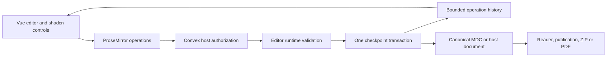

# Ginko Editor implementation handoff

## 1.0 readiness status — 2026-09-26

Local branches only; nothing is pushed or published.

| Repository | Branch | State |
| --- | --- | --- |
| Ginko Content | `fix/mdc-roundtrip-contract` | Lossless MDC serialization (text, code, headings, typed, quoted and multi-line props, URLs), parser-aligned heading ids, portable link rules, stable `cms-contract` exports. `pnpm verify` passes. Release as `1.0.0-beta.10`. |
| Ginko Editor | `feat/v1-readiness` | Package shape, API refactor, layout kit and container editing, grouped block menu, collaboration hardening and presence, save-path property test. `pnpm verify`, packed consumers, and audit pass against the Content candidate. |

Release order:

1. Review and merge the Content branch, then publish Content `1.0.0-beta.10` through its release workflow.
2. Remove the Content candidate migration in `internals/migrations.md` and run `pnpm release:verify`.
3. Merge `feat/v1-readiness` (it contains the unmerged `fix/runtime-declarations` work) and publish the Editor. The publish workflow refuses unpublished peers.
4. Update Ginko CMS: reconcile `feat/shared-editor` and `codex/cms-experience-editor-integration`, adopt the narrowed editor handle and `runtime` type imports, and validate stored bodies with Content's policy on save.

Known limits: named component slots such as card titles are preserved but have
no dedicated editor; the figure recipe uses a URL property, not the image
picker; block-menu recents are kept only in memory; the Docs policy accepts any
string for `card.to`, so its renderer must check links.

Research and implementation completed locally on 2026-09-22. The shared editor
now has a Vue multiplayer path through Convex, safer slash insertion, independent
component-property operations, and verified integrations in CMS, Luis and
ChiliSkills. Production publication and deployment are separate operator actions.

## Recommended architecture

Keep Vue, TipTap and ProseMirror. Ginko Content remains the parser and portable
content authority. Ginko Editor owns its derived editor schema, conversion and
editing session. Each application owns authorization, persistence, assets and
publication. No additional collaboration server or second content format was
introduced.

The best experience is one clear writing surface with an Insert button and inline
slash search, contextual component controls, a visible save state, and host
workflow actions outside the canvas. Narrow screens use a compact selector rather
than a second pane. The [research report](./editor-experience-research-2026-09-22.md)
contains the comparisons, source references, interaction requirements and
alternatives.

Ginko Content needed **no new code**. Published `1.0.0-beta.9` already provides
the required parser, policy, semantic comparison and asset contract. Consumers
now use that registry release instead of the beta.7 archive. Collaboration state
belongs to the Editor and host; it does not become another Content parser.

## Delivered changes

| Area | Result | Source state |
| --- | --- | --- |
| Editor | Runtime-safe entry; inline slash search; per-property mapped operations; Vue collaboration; bounded history/recovery; NodeNext declarations | Current repository, implementation commits through `e579d55`; final documentation follows |
| CMS | Shared entry bodies; atomic draft and asset checkpoints; save/publish/switch barriers; authorization and recovery | `feat/shared-editor`, commit `ba9088d` |
| Luis | Shared narrative fields; stable section identity; conflict-safe forms; one Content-based HTML/PDF projection; PDF link fix | `feat/shared-document-editor`, preserved user WIP plus isolated patch |
| ChiliSkills | Optional shared module copies; scripts and text; module roles; verified account access; upload ownership; ZIP export; mobile selector | `feat/shared-module-scripts`, commit `18eb99a` |

The host worktrees are:

- CMS: `/Users/matthias/.codex/worktrees/ginko-editor-shared/cms`.
- Luis: `/Users/matthias/.codex/worktrees/ginko-editor-shared/luis`.
- ChiliSkills: `/Users/matthias/.codex/worktrees/ginko-editor-shared/chiliskills`.

The supplied application checkouts remain untouched. CMS and ChiliSkills have
clean committed implementation branches. Luis already contained a substantial
uncommitted document feature. Its integration worktree contains that baseline and
the finished editor changes; unrelated WIP was not committed.

The [Luis changes patch](/Users/matthias/.codex/worktrees/ginko-editor-shared/luis/internals/shared-editor-changes.patch)
contains only the 34 files changed by this integration, relative to the preserved
working baseline. It was applied to a temporary baseline and every resulting
file matched the integration worktree. It is not a patch against clean `main`.
SHA-256: `fa912b86af8c62543f39119f3600615e20fc33661b1947713c0b56a05f716327`.
The original tracked Luis WIP still matches its saved starting diff.

## Verification

| Project | Automated gate | Additional evidence |
| --- | --- | --- |
| Editor | 309 tests; lint; types; package and Docs builds | Packed Node runtime and NodeNext types; isolated Vue/Nuxt consumers; real Convex concurrency, offline/reload recovery and independent-property convergence |
| CMS | 1,319 tests; one skipped; full check | pnpm and strict npm packed consumers; real packed backend with two actual field components; component title/tone convergence; zero competing form writes |
| Luis | 395 tests; full check; Convex types | Two actual narrative editors and normal authenticated members; revision 7 convergence; prices preserved; two-page PDF inspected; link annotation verified |
| ChiliSkills | 91 tests; full check, frontend and Convex types | Real HTTP upload ownership; two writers at revision 7; permission loss and reload recovery; actual workspace metadata save and ZIP at revision 8; local mode and 390 px view; PPTX text/image export |

Independent review covered the Editor runtime and collaboration protocol, host
integration boundaries, lost-update risks, permissions, upload ownership and
recovery. Concrete findings were fixed and rechecked. The final focused review
reported no remaining blocker in the reviewed changes.

Editor, CMS and ChiliSkills dependency audits were clean at verification.
ChiliSkills retains peer-range notices for KaTeX, optional TypeScript and optional
root Zod resolution; its complete checks pass. The notices are documented rather
than suppressed. Existing PPTist Sass deprecation and bundle-size warnings remain.
No dependency-quarantine exception was added by this work.

Reproduction and operational details:

- [Editor backend proof](./collaboration-verification.md).
- [CMS shared bodies](/Users/matthias/.codex/worktrees/ginko-editor-shared/cms/internals/shared-editor.md).
- [Luis shared documents](/Users/matthias/.codex/worktrees/ginko-editor-shared/luis/docs/operations/shared-document-editor.md).
- [ChiliSkills shared authoring](/Users/matthias/.codex/worktrees/ginko-editor-shared/chiliskills/internals/shared-authoring.md).

## Package and rollout boundaries

Editor `0.1.0` is a verified **unpublished** archive. All three host integrations
use the same code archive from `e579d55`, SHA-256
`aa075de076960731a77d83e57e91f6457d98ddd6e10b5371968a3732728ee3a9`.
CMS public manifests declare the intended registry version; a private workspace
override selects the local archive. Luis and ChiliSkills vendor it explicitly.
The normal registry consumer gate must run after Editor publication. Candidate
success does not establish that an ordinary npm install can resolve it today.

Docs authoring candidates are also explicit: Editor documentation uses
`0.4.0-rc.11`; ChiliSkills keeps its verified `0.4.0-rc.10` archive. Their removal
conditions are tracked in the owning repositories. Content beta.9 is already a
registry release with verified provenance.

No package was published, no PR or branch was pushed, and no production system
was deployed. Before rollout, use the established package release workflow,
replace candidate archives with verified registry releases, and run the registry
consumer gate. Deploy each host through its normal release and backup procedure.
ChiliSkills also needs its real Google OAuth settings, allowlist, Better Auth
secrets and signing key. The actual Google consent flow requires that configured
deployment and was not exercised by the local signed-identity proof.

## Deliberate limits

- Shared edits persist through a reload in the same tab. Permanent tab closure,
  expired history and changed epochs require an explicit recovery copy; there is
  no general recovery-file import screen or unlimited offline merge guarantee.
- Multiplayer cursor presence, comments and collaborative slide layout are not
  part of this implementation. Shared table column geometry stays fixed.
- ChiliSkills shares scripts, text and metadata. Slide structure and design stay
  local. Its shared copy is independent of the local module; ZIP is the transfer
  boundary. Incomplete uploads can leave orphan storage objects, and storage
  URLs are bearer URLs rather than authenticated private-file endpoints.
- Luis renders supported prose consistently in HTML and PDF. Unsupported markup,
  complex blocks inside list items and prose images remain visible source rather
  than being silently dropped or fetched during PDF generation.
- These are local correctness and integration checks, not production load tests.

Temporary test credentials, databases, preview servers and verification tabs are
removed at handoff. The source worktrees, package archives, patch and test logs
remain available. No unrelated process or application data is cleaned up.
